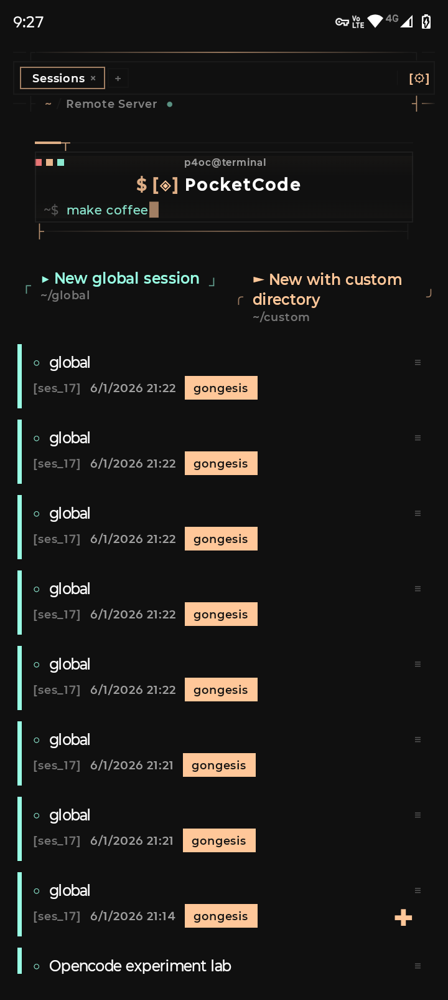
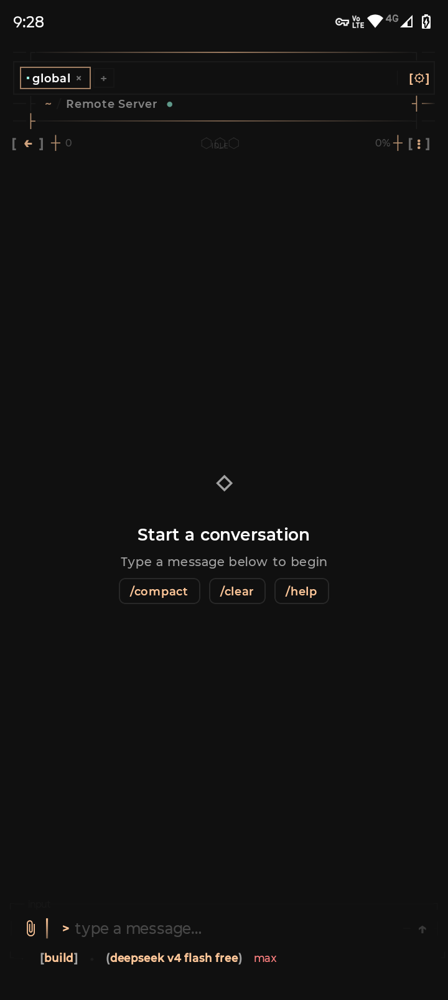

# P4OC (Pocket for OpenCode)

[](https://github.com/KakashiTech/P4OC/releases)
[](LICENSE)

<a href="https://play.google.com/store/apps/details?id=dev.blazelight.p4oc">
  
</a>

> **P4OC is an Android client for [OpenCode](https://github.com/anomalyco/opencode) — the terminal-based AI coding assistant.** It is **not** part of OpenCode itself, nor is it affiliated with the OpenCode team. It's a third-party client that speaks the OpenCode protocol, nothing more.

This project is a **fork** of the original [P4OC by Jasmin Le Roux](https://github.com/theblazehen/P4OC). All credit for the original work goes to them — this fork just adds a few tweaks on top.

Point it at a running server, and your phone becomes a pocket-sized AI pair programmer. Built with love by nerds for nerds.

The whole thing wears its terminal heritage like a badge of honor. No rounded corners. No stock Material3 cards. Every pixel is flat, monospaced where it counts, and styled like it escaped from a TUI. The app ships with **38 hand-picked color themes** synced directly from OpenCode's own CLI — because your AI should look good while it writes code for you.

## Quick Start

1. Start OpenCode in server mode:
   ```bash
   opencode serve --hostname 0.0.0.0 --port 4096
   ```
   Set `OPENCODE_SERVER_PASSWORD` for authentication.

2. Install P4OC from [Google Play](https://play.google.com/store/apps/details?id=dev.blazelight.p4oc) or [GitHub Releases](https://github.com/KakashiTech/P4OC/releases)

3. Point it at your server, pick a theme, and start hacking

## What it does

You connect to an OpenCode server, and the phone becomes a full remote control for your AI coding assistant:

- **Chat with streaming SSE** — see the AI think in real time
- **Session management** — create, rename, share, summarize, diff, revert
- **File browser** — browse project files with symbol search and syntax highlighting
- **Diff viewer** — watch the AI's edits with clean add/delete highlighting
- **Embedded terminal** — Termux-powered shell in your pocket
- **Sub-agent tabs** — open child sessions in their own tabs like a browser
- **Provider config** — wire up your own models, agents, and skills
- **38 color themes** — catppuccin (3 variants), dracula, gruvbox, nord, tokyonight, rosepine, kanagawa, and 30 more from OpenCode's CLI

The release APK clocks in around 2.9 MB. No bloatware. No tracking. Just a sharp tool.

## Screenshots

<p align="center">
  
  &nbsp;&nbsp;
  
</p>

## Requirements

- Android 8.0+ (API 26)
- A running [OpenCode](https://github.com/anomalyco/opencode) server

## Building

You need Java 17 and the Android SDK.

```bash
# Debug build (no signing required)
export JAVA_HOME=/usr/lib/jvm/java-17-openjdk
./gradlew :app:assembleDebug
```

The APK lands in `app/build/outputs/apk/debug/`.

For release builds, create a `local.properties` file in the project root with your signing config:

```properties
RELEASE_STORE_FILE=/path/to/your/keystore.jks
RELEASE_STORE_PASSWORD=your_store_password
RELEASE_KEY_ALIAS=your_key_alias
RELEASE_KEY_PASSWORD=your_key_password
```

Then:

```bash
./gradlew :app:assembleRelease
```

## How it works

The app connects to an OpenCode server over HTTP. Retrofit handles REST, and LaunchDarkly's EventSource library streams SSE in real time. Messages arrive as server-sent events — the app parses, renders, and scrolls as they come in.

Architecture is MVVM with clean-agnostic layers:

```
app/src/main/java/dev/blazelight/p4oc/
├── core/        # Network, DataStore, connection management
├── data/        # DTOs, mappers, repositories
├── di/          # Koin DI modules
├── domain/      # Domain models, repository interfaces
├── terminal/    # Termux terminal emulator
└── ui/
    ├── components/  # Shared TUI components, markdown renderer, code blocks
    ├── navigation/  # NavGraph, route definitions
    ├── screens/     # Chat, sessions, projects, settings, terminal, files, diff
    └── theme/       # Custom theme system with 38 OpenCode themes
```

## Theme system

The app uses a custom theme system — no Material3 theming involved. There are ~50 semantic color tokens (`LocalOpenCodeTheme.current`), plus `Spacing.*`, `Sizing.*`, `TuiShapes` (all 0dp corners), and `Motion.*` tokens. Themes load from JSON files that follow OpenCode's native theme format.

All 38 bundled themes are synced directly from OpenCode's CLI source:
aura, ayu, carbonfox, catppuccin (×4), cobalt2, cursor, deltarune, dracula, everforest, flexoki, github, gruvbox, hotdogstand, kanagawa, lucent-orng, material, matrix, mercury, monokai, mytheme, nightowl, nord, one-dark, opencode, orng, osaka-jade, palenight, rosepine, solarized, synthwave84, tokyonight, undertale, vercel, vesper, xterm, zenburn

## Tech stack

| What | Version |
|------|---------|
| Kotlin | 2.3.0 |
| AGP | 9.0.0 |
| Compose BOM | 2026.01.01 |
| Min SDK | 26 (Android 8.0) |
| Target SDK | 35 |
| Compile SDK | 36 |

Networking: OkHttp 5.3 + Retrofit 3.0. DI: Koin 4.1. Database: Room 2.8. Serialization: kotlinx.serialization 1.10. Markdown: mikepenz multiplatform-markdown-renderer. Terminal: Termux terminal-emulator + terminal-view.

## Contributing

See [CONTRIBUTING.md](CONTRIBUTING.md).

## License

Copyright 2025 Jasmin Le Roux

Licensed under the GNU General Public License v3.0. See [LICENSE](LICENSE) for the full text.
